# Práctica 04 — Desplegar un recurso real y medir su coste en Azure

**Alumno:** hectormtudela06
**Resource Group:** `rg-practica04-vm-hectormtudela`
**Fecha de inicio:** 22/09/2026
**Región final de la VM:** Spain Central *(ver Sección 6 — no fue una elección libre, sino el resultado de varias restricciones reales de la suscripción)*

---

## Sección 3 — Estimación de coste (Pricing Calculator)

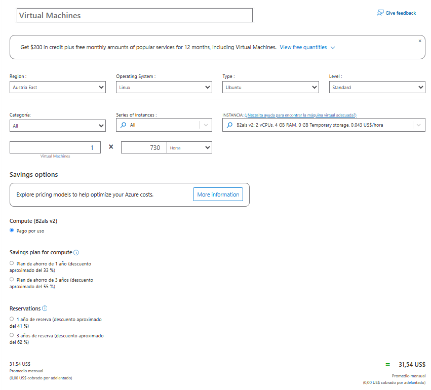
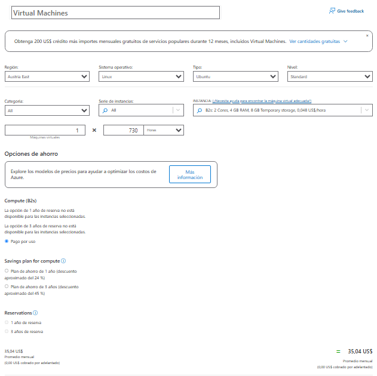
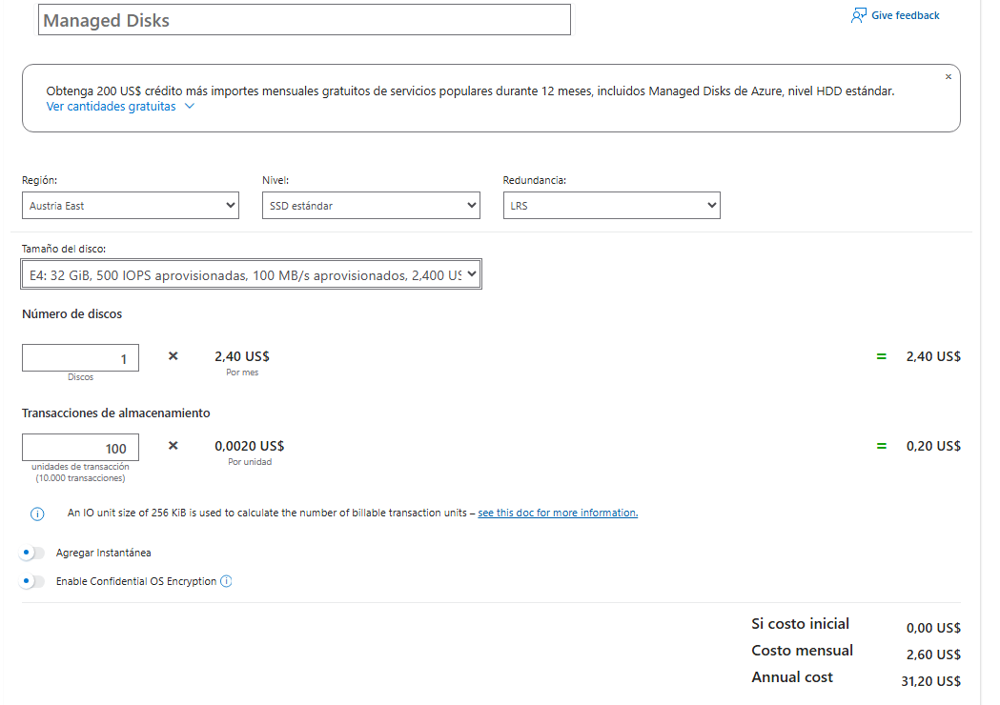
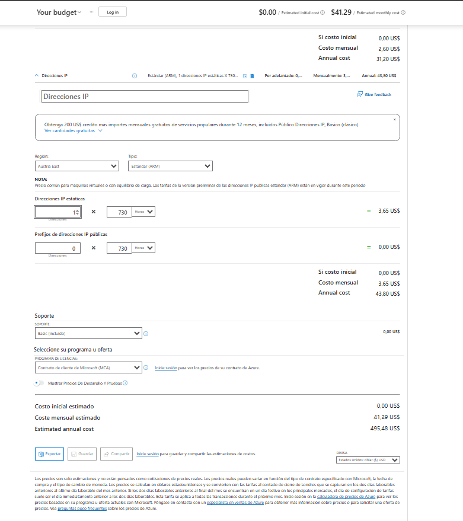
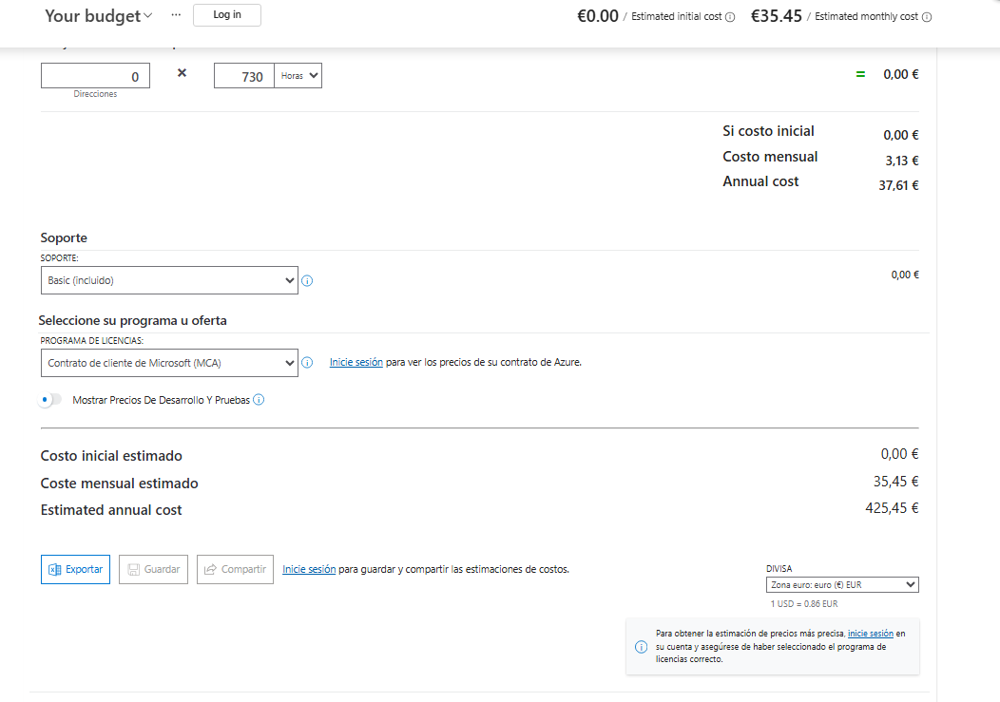
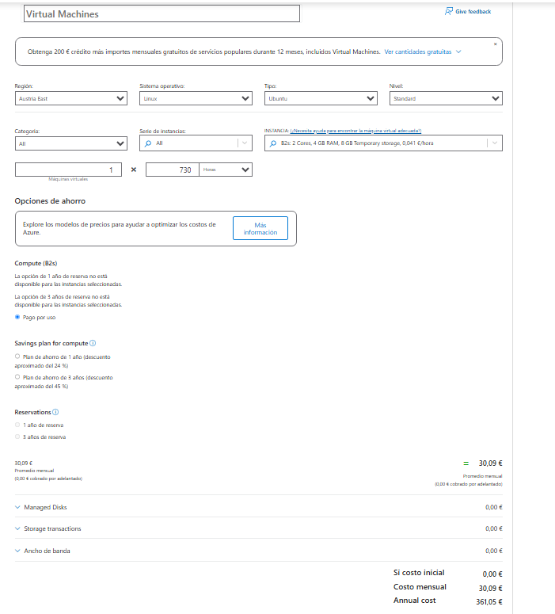

| Escenario | Horas de cómputo | Coste cómputo | Coste disco (72 h) | Coste IP (72 h) | Total estimado |
|---|---|---|---|---|---|
| A. VM encendida todo el laboratorio | 72 | 2,95 € | 0,22 € | 0,31 € | **3,48 €** |
| B. VM con apagado automático nocturno (~12 h/día) | 36 | 1,48 € | 0,22 € | 0,31 € | **2,01 €** |
| C. VM encendida solo 8 h en total | 8 | 0,33 € | 0,22 € | 0,31 € | **0,86 €** |

**Datos base (Austria East, en euros):**
- VM B2s: 0,041 €/hora
- Disco Standard SSD 32GB: 2,23 €/mes → 0,22 € a 72h
- IP pública Standard estática: 3,13 €/mes → 0,31 € a 72h

---

## Sección 4 — Resource Group etiquetado

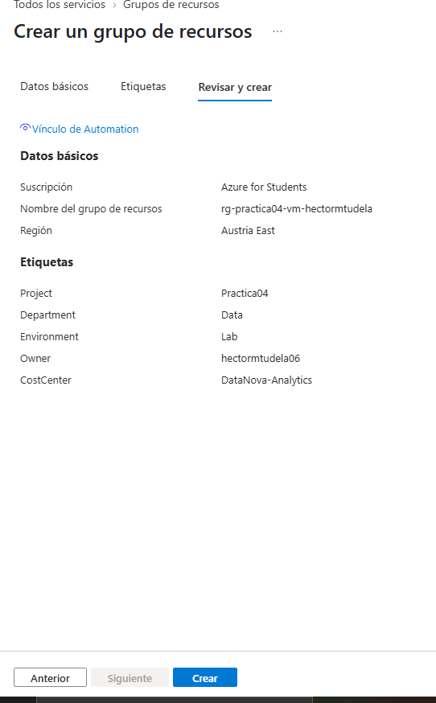

| Tag | Valor |
|---|---|
| Project | Practica04 |
| Department | Data |
| Environment | Lab |
| Owner | hectormtudela06 |
| CostCenter | DataNova-Analytics |

---

## Sección 5 — Budget del laboratorio

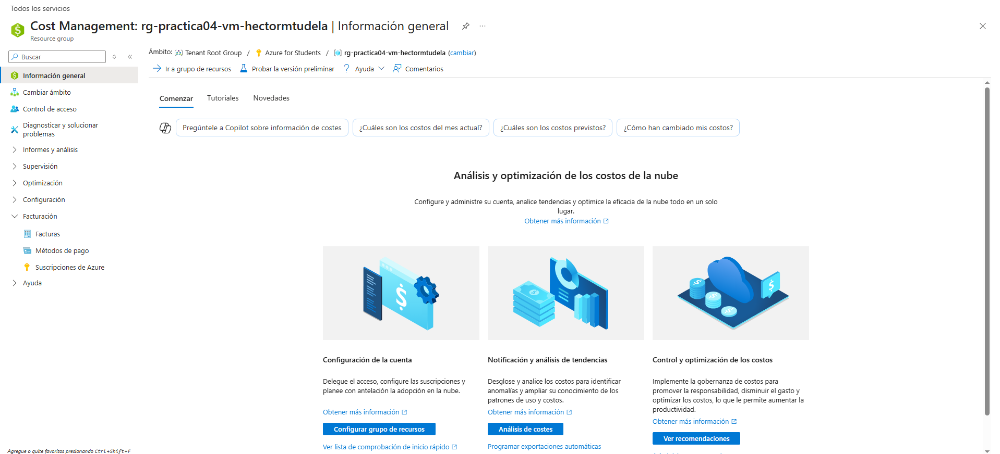
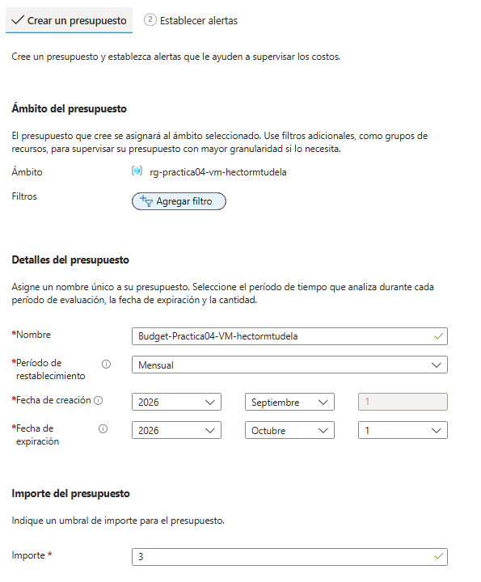
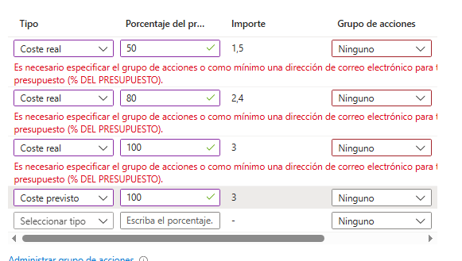

| Campo | Valor |
|---|---|
| Name | `Budget-Practica04-VM-hectormtudela` |
| Amount | 3 € (Escenario B: 2,01 € redondeado) |
| Reset period | Monthly |

| Tipo | Umbral | Importe | Qué significa |
|---|---|---|---|
| Actual | 50 % | 1,5 € | Se ha gastado la mitad de lo previsto |
| Actual | 80 % | 2,4 € | El laboratorio se acerca al límite |
| Actual | 100 % | 3 € | Se ha alcanzado lo estimado |
| Forecasted | 100 % | 3 € | Azure prevé que el mes superará el Budget |

**Predicción (antes del Día 2):** _(escribe aquí si crees que se activará la alerta Forecasted)_

---

## Sección 6 — Despliegue de la máquina virtual

### 6.1 — Configuración final

| Dato | Valor |
|---|---|
| Región final | **Spain Central** |
| Tamaño final | **Standard_B2s_v2** (2 vCPU, 8 GiB RAM) — sustituto de `B2s`, ver 6.2 |
| Precio por hora (estimado, B2s en Austria East) | 0,041 €/hora |
| Precio real (B2s_v2, Pricing Calculator en Spain Central) | *(pendiente — consultar calculador)* |
| Fecha y hora de creación | 22/09/2026, 20:38 UTC |
| Método de despliegue | **Azure CLI (Cloud Shell)**, tras fallos repetidos del asistente gráfico del portal |
| Apagado automático | No configurado — indicación del profesor por fallo conocido de la plataforma en esta práctica |
| Disco del SO | Standard SSD, eliminar con VM ✅ |
| Puertos de entrada | Ninguno |

### 6.2 — Diario de incidencias (importante para el informe)

Esta sección documenta por qué la configuración final difiere de la especificada originalmente por la práctica (`Standard_B2s` en una región europea cualquiera), y sirve como evidencia de resolución de problemas reales de plataforma:

1. **Región `Austria East` no aparece en el selector del asistente** → sustituida por `West Europe`.
2. **`West Europe` bloqueada por política de la suscripción** (error `RequestDisallowedByAzure` en "Revisar y crear", afectando a todos los recursos: VM, disco, IP, NIC, NSG, VNet).
3. **Consulta a Azure Policy → Assignments → "Allowed resource deployment regions"**: la suscripción `Azure for Students` solo permite desplegar en 5 regiones exactas: `germanywestcentral`, `belgiumcentral`, `spaincentral`, `italynorth`, `francecentral`. Estas no coinciden con las que el asistente gráfico ofrece como "Recomendado", lo que causó varios intentos fallidos previos.
4. **`France Central` sí está permitida, pero el tamaño `B2s` (y toda la serie B) aparece como "Tamaño no disponible"** ahí.
5. **Consulta a Suscripción → Uso y cuotas**, filtrando por `Microsoft.Compute` y familia `BS`: se confirma que la familia **`Bsv2`** tiene cuota disponible (10 vCPUs, 0% de uso) en **Spain Central**, mientras que otras combinaciones región/familia devuelven error al consultarlas.
6. **Se despliega la VM con Azure CLI** (`az vm create`) en `spaincentral` con `Standard_B2s`: falla con **`SkuNotAvailable` por restricción de capacidad** (no de política — Azure confirma que la región está permitida, pero no hay capacidad física de ese tamaño en ese momento).
7. **Se repite el comando sustituyendo el tamaño por `Standard_B2s_v2`** (misma familia B, 2 vCPU, más RAM): **despliegue correcto**, confirmado en el Registro de actividad del Resource Group (`Create or Update Virtual Machine — Correcto`).
8. **Apagado automático por CLI (`az vm auto-shutdown`) también falla** con el mismo error de política (`RequestDisallowedByAzure`), porque ese comando usa por defecto la región del *Resource Group* (creado originalmente en Austria East) en vez de la región real de la VM. El profesor indica que esta función tiene un fallo conocido en la práctica y que no es necesario configurarla.

**Conclusión:** la sustitución de `B2s` por `B2s_v2` y el cambio de región de Austria East a Spain Central están justificados por restricciones reales, verificables y documentadas de la suscripción — no por elección arbitraria. Esta diferencia se recoge en la comparación estimado vs. real de la Sección 10.

### 6.3 — Capturas del proceso (en orden cronológico)

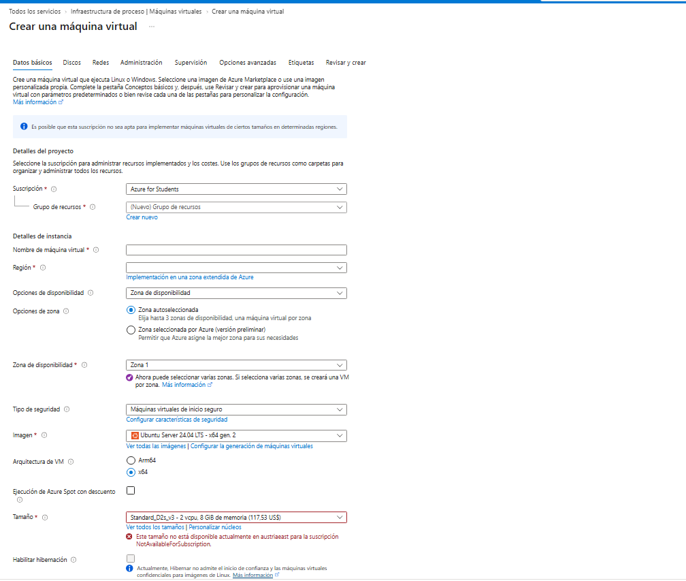
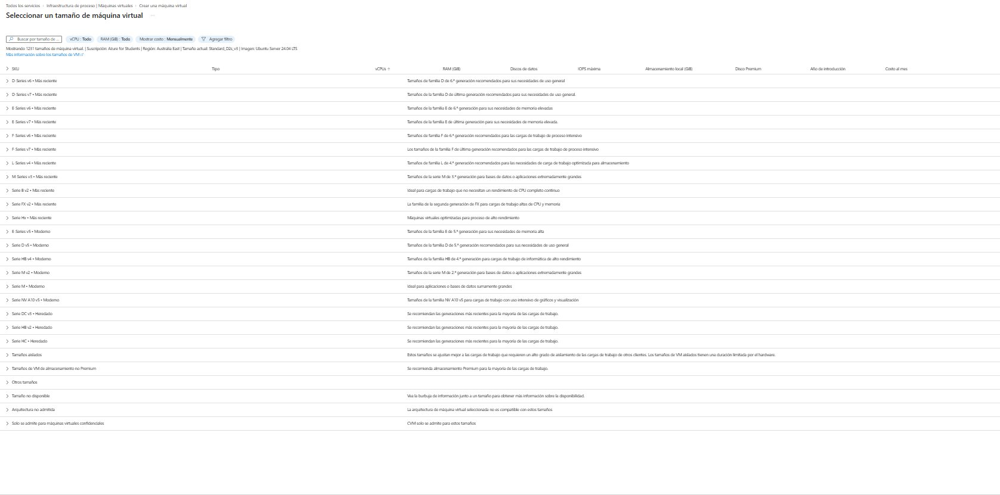
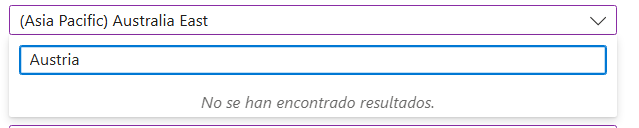
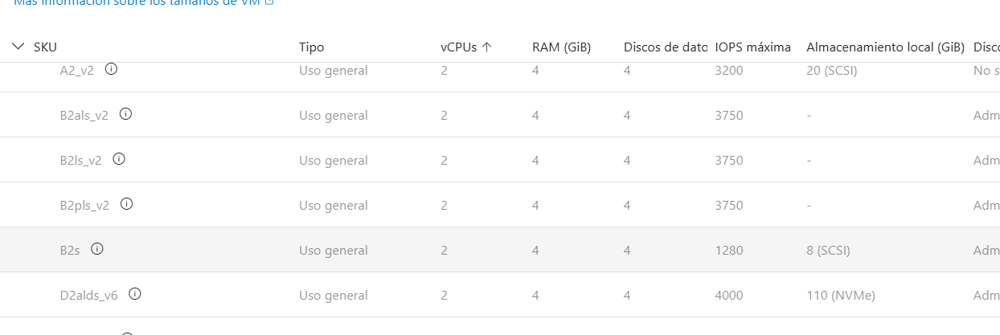
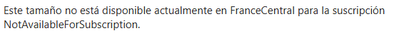
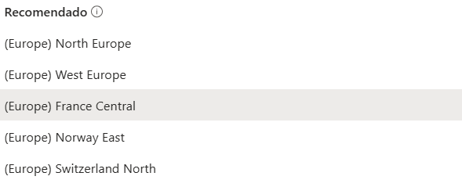
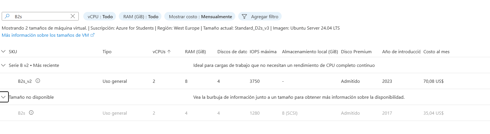
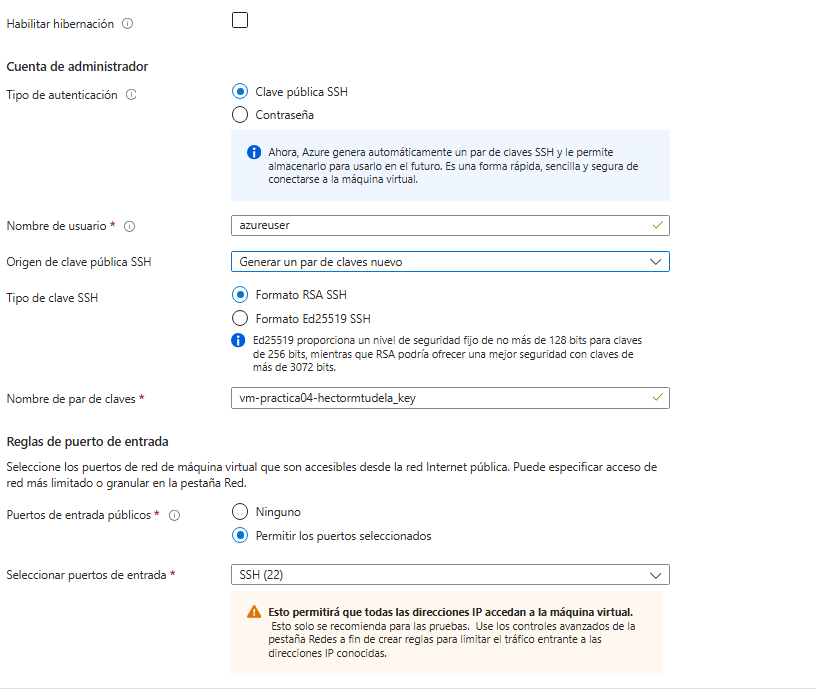
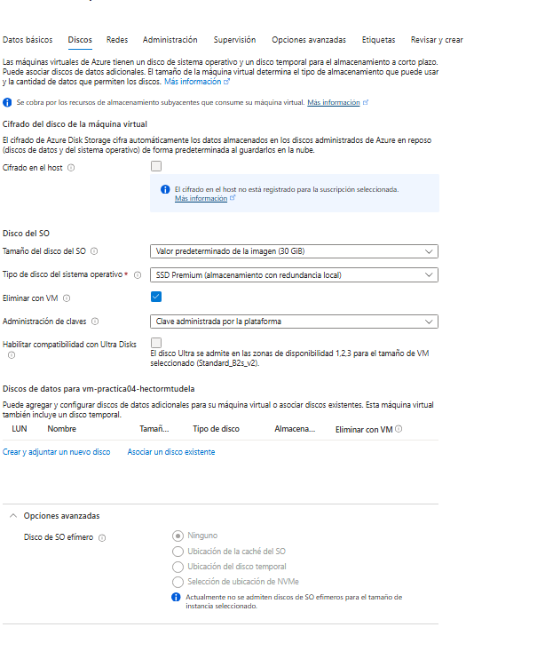
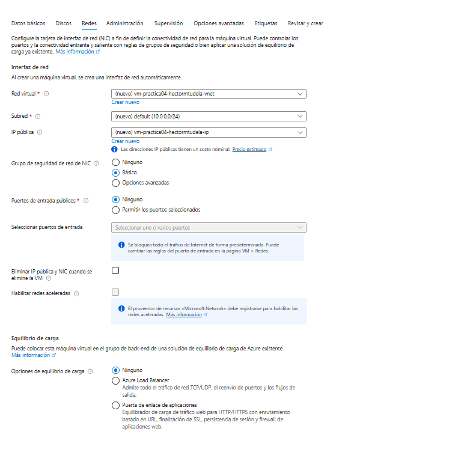
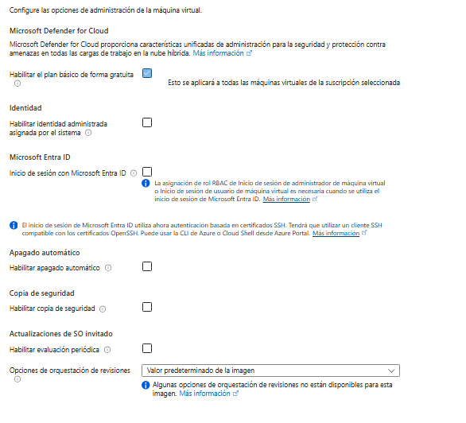
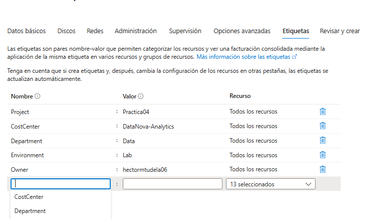
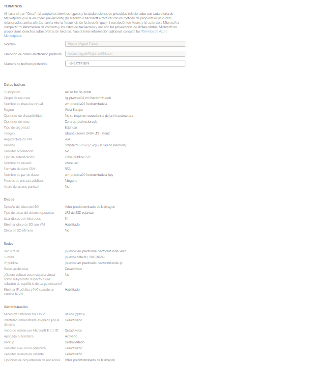
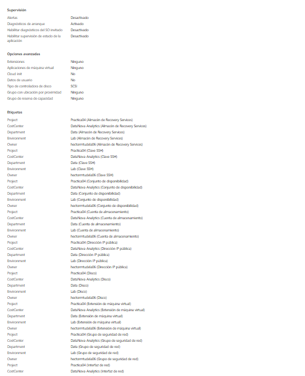
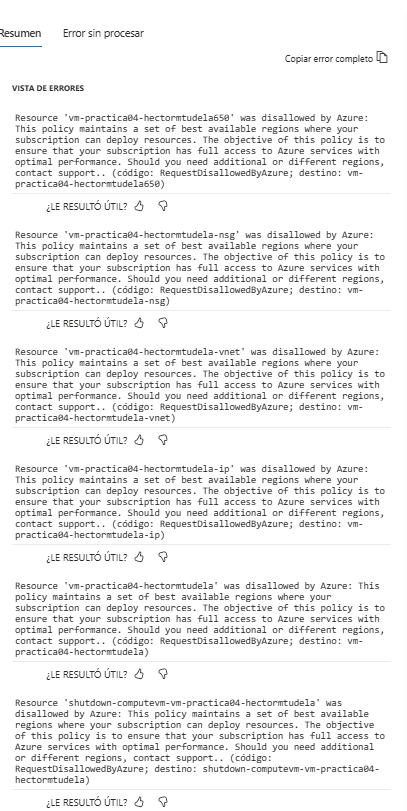
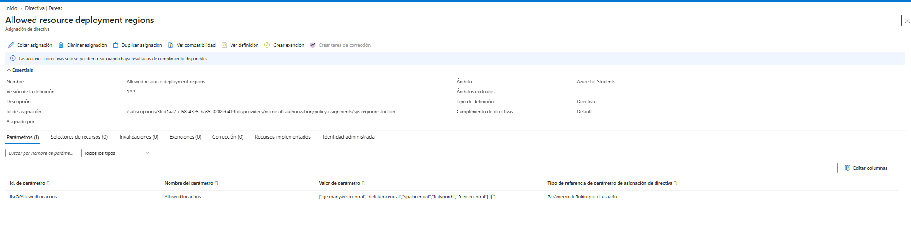
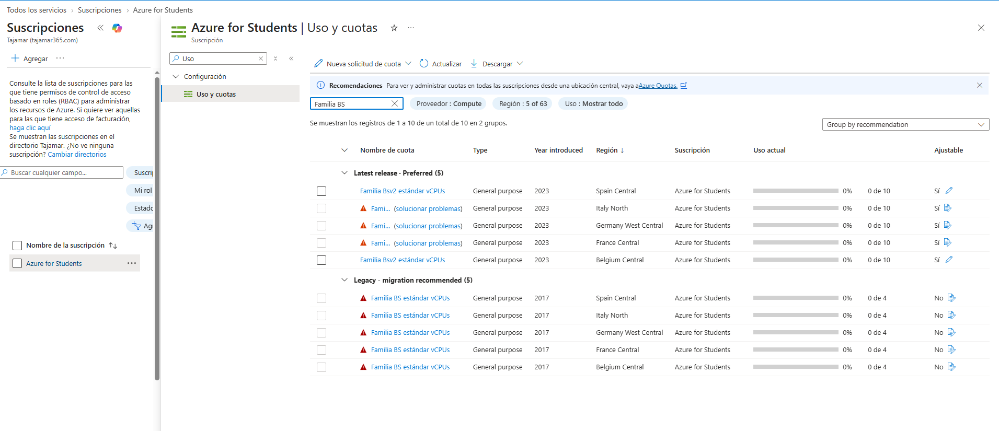
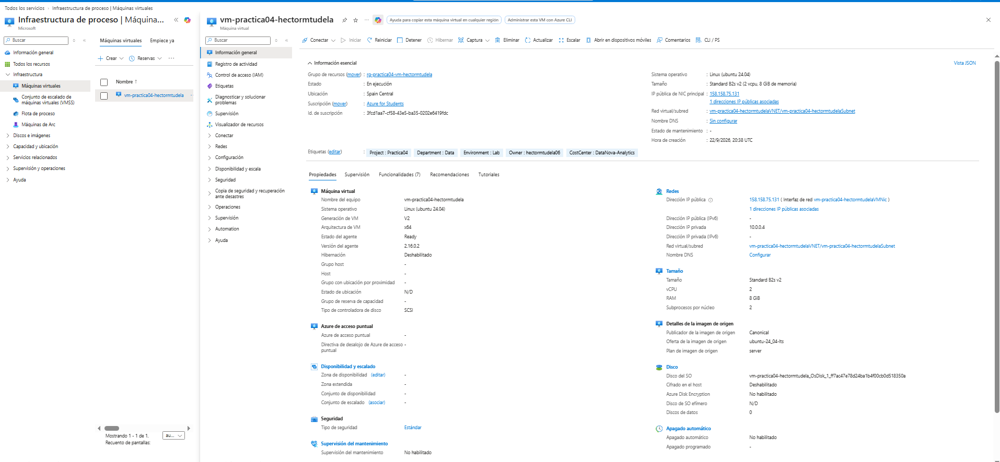
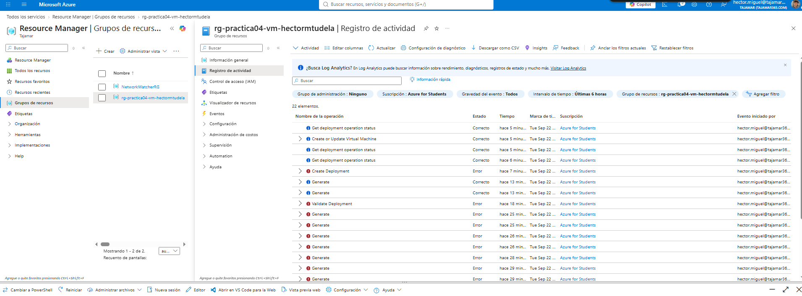

---

## Sección 7 — Verificación del etiquetado

| Recurso | Tipo | ¿Tiene los 5 Tags? | ¿Genera coste? |
|---|---|---|---|
| vm-practica04-hectormtudela | Virtual machine | | |
| | Disk | | |
| | Public IP address | | |
| | Network interface | | |
| | Network security group | | |
| | Virtual network | | |

---

## Sección 8 — Primera revisión en Cost Analysis (Día 2)

**Primera comprobación (23/09/2026, mañana):** 0,01 €. **Segunda comprobación (24/09/2026):** 2,27 € — la VM ya lleva un día completo funcionando y el coste ha subido notablemente, como se ve en el pico de la gráfica diaria a partir del 22-23 de septiembre (día de creación).

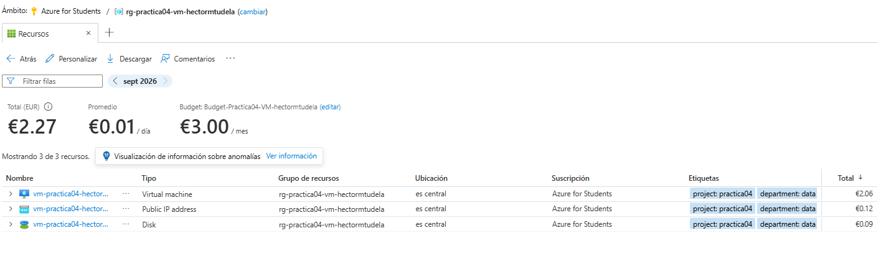

| Recurso | Coste acumulado |
|---|---|
| Máquina virtual | 2,06 € |
| Disco | 0,09 € |
| IP pública | 0,12 € |
| Otros (ancho de banda) | < 0,01 € |
| **Total (Actual Cost)** | **2,27 €** |

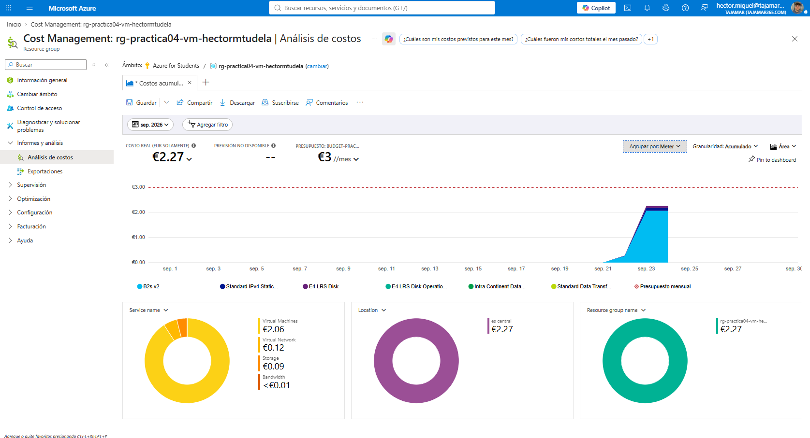

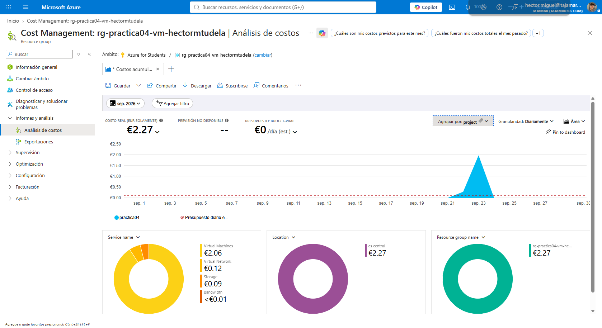

**Verificación por Tags:** al agrupar por Tag → Project, todo el gasto (2,27 €) aparece bajo la etiqueta **"practica04"**, sin ninguna parte como "Untagged" — confirma que el etiquetado de todos los recursos (VM, disco, IP) es correcto.

| Dato | Valor |
|---|---|
| Actual Cost | 2,27 € |
| Forecasted Cost (fin de mes) | No disponible todavía (Azure muestra "Previsión no disponible" y "€0/día (est.)" — necesita más histórico) |
| Budget del laboratorio | 3 € |
| ¿Actual supera el Budget? | No (2,27 € < 3 €), pero ya ha superado el umbral del 50% (1,5 €) |
| ¿Forecast supera el Budget? | No se puede determinar todavía |

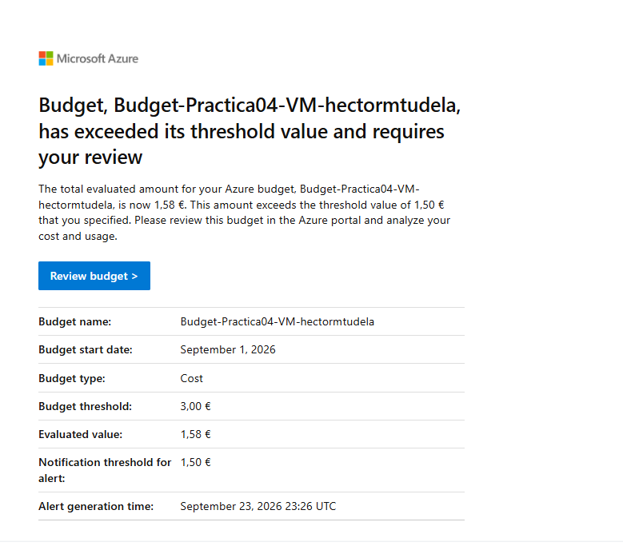

| Alerta | ¿Se ha activado? | Fecha y hora |
|---|---|---|
| Actual 50 % | ✅ Sí | 23/09/2026, 23:26 UTC (valor evaluado: 1,58 €) |
| Actual 80 % | *(pendiente — coste actual 2,27 € aún no llega a 2,40 €)* | |
| Actual 100 % | *(pendiente)* | |
| Forecasted 100 % | *(pendiente — Azure aún no calcula previsión)* | |

**¿Se cumplió la predicción de la Sección 5?** Parcialmente: se predijo que la alerta **Forecasted** sería la primera en activarse, pero en la práctica ha sido la **Actual 50%** la primera en dispararse, ya que Azure todavía no ha podido calcular una previsión fiable (falta de histórico suficiente en estos primeros días). Es un buen ejemplo de que el comportamiento real de la plataforma no siempre coincide con lo esperado sobre el papel.

---

## Sección 9 — Experimento: apagar vs. desasignar

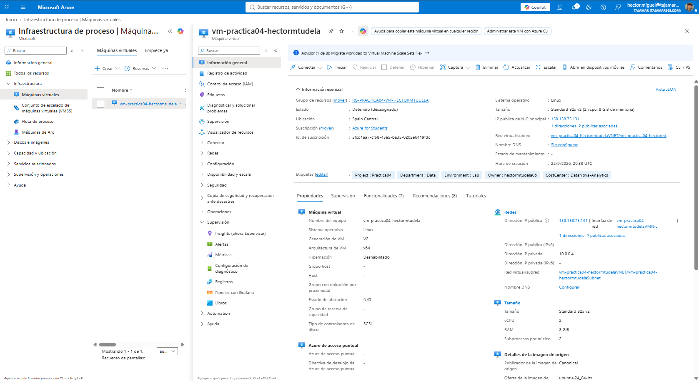

| Medidor | Coste Día 1 | Coste Día 2 | Coste Día 3 |
|---|---|---|---|
| Cómputo B2s | | | |
| Disco Standard SSD | | | |
| IP pública | | | |

1. ¿Qué medidor baja cuando la VM está desasignada? _(respuesta)_
2. ¿Qué medidores siguen generando coste? _(respuesta)_
3. Si un compañero deja 20 VMs apagadas desde el sistema operativo durante un fin de semana, ¿qué está pagando DataNova? _(respuesta)_
4. ¿Qué acción garantizaría que ningún medidor siga cobrando? _(respuesta)_

---

## Sección 10 — Comparación estimación vs. real (Día 3)

| Concepto | Estimado (Sección 3) | Real (Cost Analysis) | Diferencia |
|---|---|---|---|
| Cómputo | | | |
| Disco | | | |
| IP pública | | | |
| **Total** | | | |

1. ¿Qué escenario de la Sección 3 se parece más a lo que realmente ocurrió? _(respuesta)_
2. ¿Qué componente se desvió más de lo estimado? ¿Por qué? _(respuesta)_
3. ¿Algún coste no estaba en tu estimación? _(respuesta)_
4. Coste estimado para 10 analistas, 8h/día, 22 días, con los datos reales: _(respuesta)_

---

## Sección 11 — Limpieza

- [ ] Resource group eliminado
- [ ] Verificado que no queda nada bajo el Tag `Project = Practica04`
- [ ] Budget del laboratorio eliminado
- [ ] Coste diario en 0 € 24h después (verificación final)

---

## Sección 12 — Informe final

| Elemento | Resultado |
|---|---|
| Nombre de la práctica | Práctica 04 — VM Linux con control de costes |
| Resource Group | rg-practica04-vm-hectormtudela |
| Servicios utilizados | |
| Coste estimado antes de desplegar | |
| Budget disponible | |
| Alertas configuradas | |
| Alertas activadas | |
| Coste observado | |
| Recurso con mayor coste | |
| Recursos eliminados | |
| Observaciones | |

---

## Sección 13 — Ejercicio final (caso DataNova Engineering)

**Datos:**
- Budget del proyecto = 50 €
- Actual Cost (día 10) = 22 €
- Forecasted Cost = 68 €
- Apagado automático = No configurado
- Estado de 3 VMs = Stopped (no deallocated)

1. ¿Qué alertas se habrán activado? _(respuesta)_
2. ¿Por qué el Forecasted Cost es tan superior al Actual Cost? _(respuesta)_
3. ¿Qué parte del gasto de las 3 VMs detenidas se podría eliminar sin borrarlas? _(respuesta)_
4. Ordena de mayor a menor impacto en ahorro inmediato: _(respuesta)_
5. ¿Qué acción no ahorra dinero pero es imprescindible para analizarlo? _(respuesta)_
